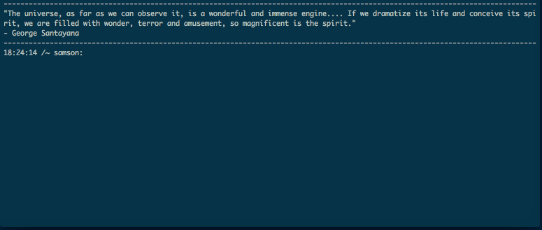

# Qotd

### Quote of the day for your Terminal


# How To:
- requires nokogiri, mechanize, phantomjs, and watir
- Place the qotd folder in your root directory, and run 
```ruby bashStuff.rb``` (only run this once)

- Then run the following everyday if you want a new quote
```ruby qotd.rb```

